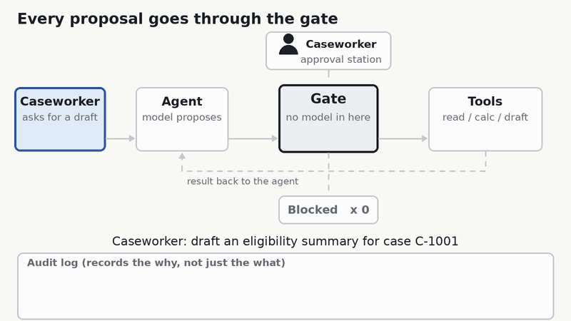

# caseworker-agent-governance-demo

A small, runnable companion to the post "Your Guardrails Can't Live Inside the Agent." It shows a
deterministic gate sitting between a scripted caseworker agent and its tools, driven by a real
Agent Format file (`agents/caseworker_assistant.agf.yaml`).

No API key, no network, no LLM. Python 3.10+, two small dependencies.



## Run it

```bash
pip install -r requirements.txt
python validate.py                 # agent file vs. the Agent Format JSON schema
python run_demo.py all             # every scenario, with a readable trace
python -m unittest discover -s tests -t .
```

Run one scenario with `python run_demo.py injection`. Add `--reviewer reject` to see the human say no.

## Step through it in a browser

`docs/index.html` is a small web walkthrough of the same story as the GIF, for every scenario. Use the
step buttons, the arrow keys, or Play. Turn on **Advanced** to see every rule the gate evaluated for each
step, where each rule comes from, the run budgets, the audit event, and the config files the gate read.

- Online: https://ctrimm.github.io/caseworker-agent-governance-demo/ (GitHub Pages, served from `docs/` on `main`)
- Locally: open `docs/index.html` in a browser. No server or build step needed.

The page is not hand-scripted. It plays back `docs/traces.js`, which `python export_traces.py` writes from
real runs of the gate, planners, and policies. After changing any of those, re-run the exporter;
`tests/test_traces.py` fails if the page data is stale.

## What each scenario demonstrates

| Scenario | What happens | Post lesson |
|---|---|---|
| `happy` | read, calculate, draft. The draft waits on human approval, then runs. | Humans at the irreversible step |
| `injection` | Instructions hidden in the case notes make the (scripted) model try `approve_payout`, a read of another client's case, and `write_record`. All three are denied. The real job still finishes. | Controls live outside the model |
| `messy` | Income is missing. The agent hands off instead of guessing. | Design for missing data |
| `loop` | A model stuck in a loop hits the run limit and is halted. | Bounded budgets |
| `killswitch` | An operator halts the run mid-flight. | Tested kill switch |
| `failclosed` | The agent file marks a policy `required: true`. Remove the policy and the agent refuses to start. | Fail closed |
| `redherring` | Simulated queue of 200 drafts with 5% known-wrong. A rubber-stamp reviewer and an attentive one have similar approval rates and very different catch rates. | Test your oversight |

## How it fits together

- `agents/caseworker_assistant.agf.yaml` declares identity, tools, limits, and which tool needs approval.
  It is the same file shown in the post and passes the official schema.
- `policy/org-baseline.yaml` is org-level policy that is always applied and can only add restrictions:
  a deny list and a per-tool scope rule (a client-file read must match the session's case ID).
- `policy/agency.privacy.pii-redaction-v1.yaml` is the policy the agent file references. It supplies PII redaction.
- `govdemo/gate.py` is the whole enforcement layer. Under 200 lines, no model in it.
- `govdemo/agent.py` has the scripted planners and the loop that routes every proposal through the gate.
- `govdemo/audit.py` writes the why (the agent's stated rationale) next to the what. PII is redacted before logging.
- `govdemo/review.py` is the red herring simulation.
- `export_traces.py` records real runs for the web walkthrough in `docs/` (`index.html`, `app.js`, `app.css`).

Every proposal takes one path: planner proposes, gate decides (allow, deny, require approval, halt),
allowed calls run, and every decision lands in the audit log.

## Why Agent Format and not Microsoft Agent Framework YAML

The gate enforces what the agent file declares. That only works if the file can declare the
guardrails. [Agent Format](https://github.com/agent-format/agent-format-schema) (from Snap) can.
Microsoft Agent Framework's declarative YAML, built on
[AgentSchema](https://github.com/microsoft/AgentSchema), mostly cannot.

| What the gate needs | Agent Format | Microsoft declarative YAML |
|---|---|---|
| Approval on a local tool, conditional on its arguments | `approval` with `args_match` and `message_template` | None for function tools. Only MCP tools have `approvalMode` (always / never / a list of tool names), with no argument conditions. |
| Run limits | `limits.max_llm_calls`, `max_tool_calls`, `max_delegation_depth` | None. The only cap is the model's `maxOutputTokens`. |
| Budget | `budget.max_duration_seconds`, `max_token_usage` | None |
| A policy the agent cannot start without | `governance_policies[]` with `required: true` | `policies` holds only an Azure content-safety reference (`rai_policy` plus a resource ID), with no `required` flag. The Python loader we checked (`agent-framework-declarative` 1.1.0) does not read it. |
| Layers can only tighten, never loosen | `tighten_only_invariant` | None |
| Validation in a test | Official JSON schema, copied into `schema/` | Schemas are published in the AgentSchema repo (`schemas/v1.0`), in YAML |

Microsoft's format is stronger where it aims: typed tool parameters, input and output schemas,
model connections, and MCP, OpenAPI and hosted tools. It describes how the agent is wired. It is not
built to carry how the agent is constrained.

On Microsoft's format this demo would still run, but most of its rules would move out of the agent
file and into this toy's own policy files. The `loop` and `failclosed` scenarios, and the
argument-based approval, would have no spec field behind them. That supports the main point here
too: guardrails belong in a layer the model cannot touch, and you should check whether your agent
format can express them before you rely on it.

This comparison reflects both projects as of October 2026. Both are moving quickly.

## What this is not

- **Not a conformant Agent Format runtime.** It reads a handful of the spec's fields and borrows the
  `args_match` operators. The spec's CLI and SDKs were not public when this was written.
- **Not Microsoft's Agent Governance Toolkit.** The policy files here use this toy's own format. If you
  want a real policy engine, use that project or something like it and read its docs.
- **Not a security boundary.** The gate and the agent share a process. Real deployments want container
  isolation and identity on top.
- **`max_token_usage` is declared but not enforced**, because there is no real model to count tokens for.
- **The reviewer models are assumptions.** The red herring numbers show the method, not real behavior.
- **All data is invented.** The income threshold is an illustrative formula, not a poverty-line table.

## Swapping in a real model

Replace a planner in `govdemo/agent.py` with a function that calls your model and yields `Action`
objects from its tool calls, feeding each `Outcome` back in. Leave the gate, audit log, and approval flow alone.
That separation is the point.

## Licenses

Code: MIT (see `LICENSE`). `schema/agentformat-schema.json` is vendored from
[agent-format-schema](https://github.com/agent-format/agent-format-schema) under Apache 2.0; see `NOTICE`.
